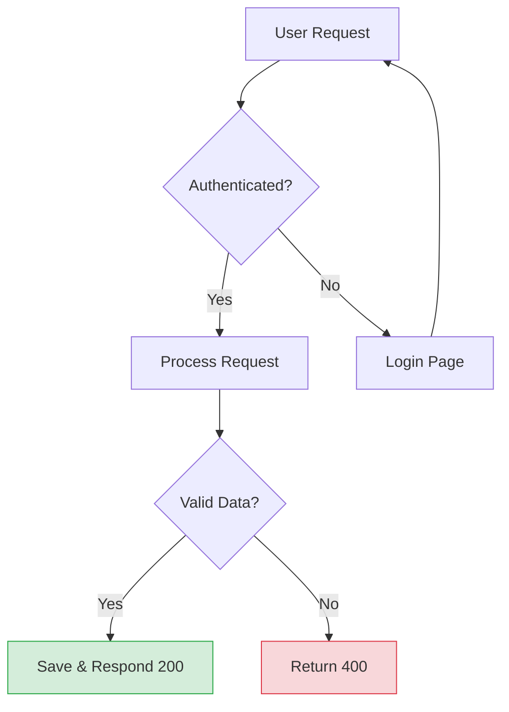
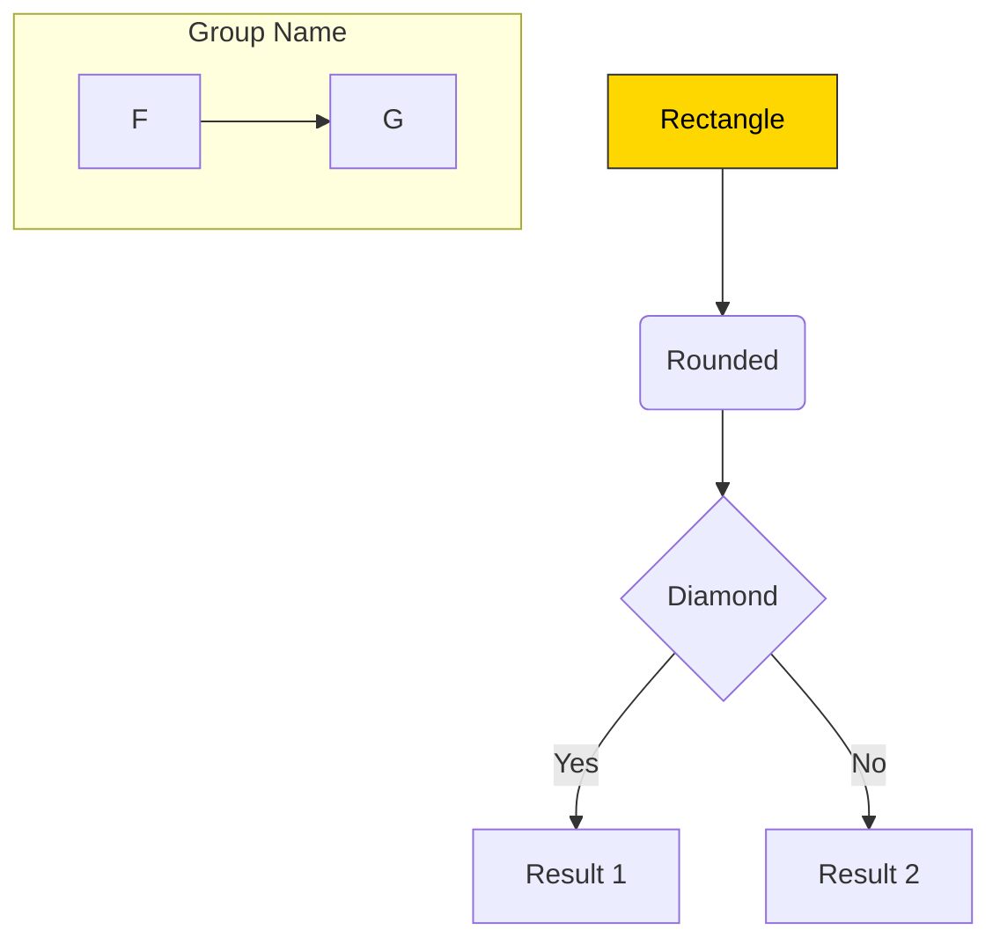
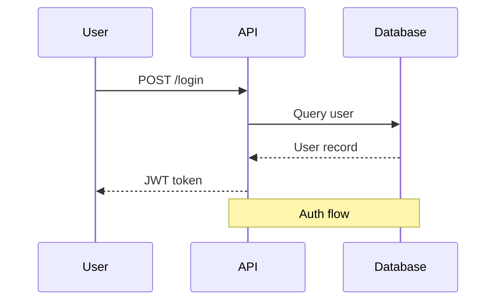
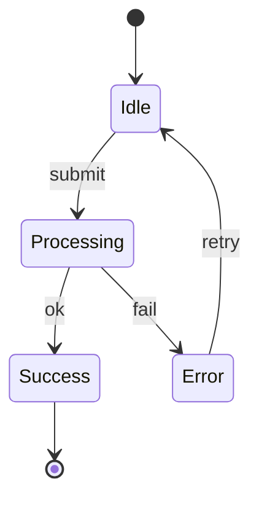
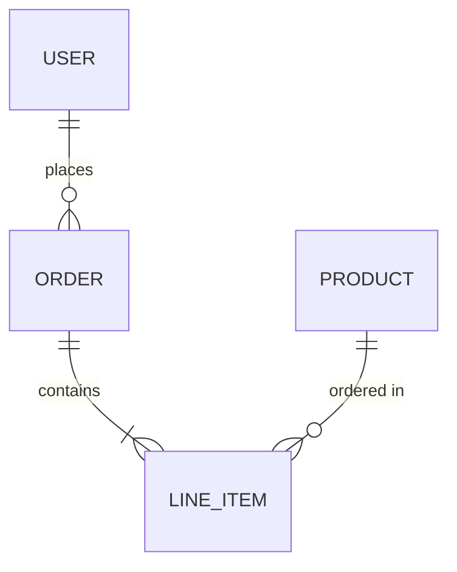
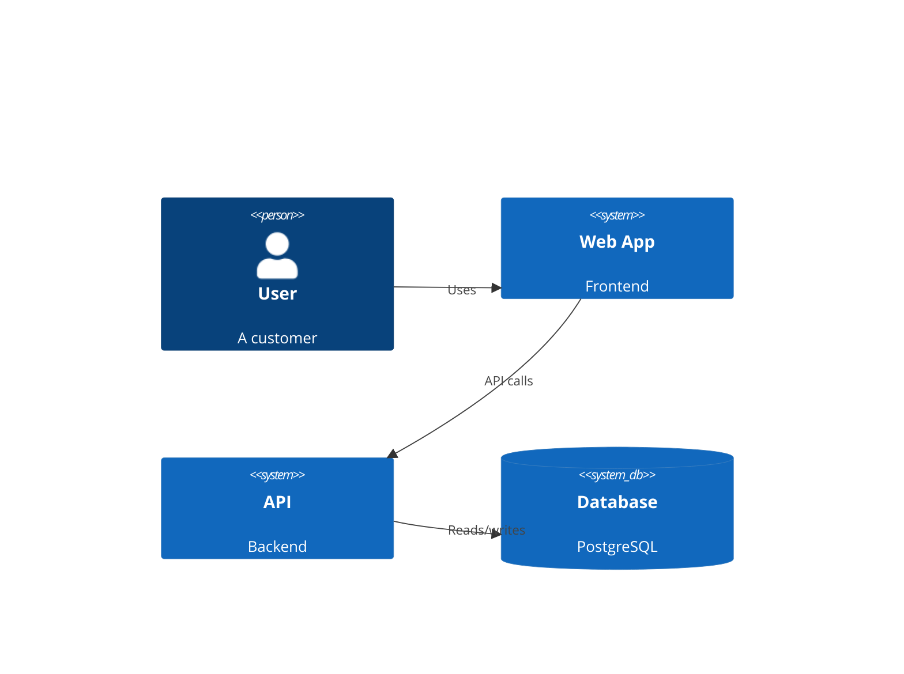
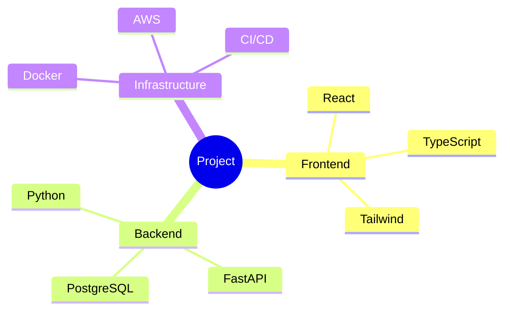

# /flowchart-server - Visual Diagram Server

Render Mermaid diagrams in a local browser with live-reload. Ideal for design reviews, architecture discussions, and visualizing complex flows.

## When to Use

- During `/brainstorming` or `/writing-plans` when a visual would clarify the design
- When explaining architecture, data flows, state machines, or sequence diagrams
- When the user asks to "show me a diagram", "draw a flowchart", or "visualize this"
- Any time a complex flow is easier to understand visually than as text

## Workflow

### 1. Determine What to Visualize

Identify the diagram type that best fits the content:

| Content | Mermaid Diagram Type |
|---------|---------------------|
| Process steps, decision trees | `flowchart TD` or `flowchart LR` |
| API call sequences, message passing | `sequenceDiagram` |
| System architecture, components | `flowchart` or `C4Context` |
| Database schema, class relationships | `erDiagram` or `classDiagram` |
| Lifecycle, transitions | `stateDiagram-v2` |
| Timeline, milestones | `timeline` or `gantt` |
| Git branching strategy | `gitGraph` |
| User journey | `journey` |
| Mind map | `mindmap` |

### 2. Write the Mermaid Code

Write valid Mermaid syntax. Key rules:

- **Node IDs**: Use short camelCase IDs (`userReq`, `authCheck`), display labels in brackets
- **Subgraphs**: Group related nodes for clarity
- **Styling**: Use `classDef` for color-coded status/categories
- **Direction**: `TD` (top-down) for hierarchies, `LR` (left-right) for sequences/flows
- **Keep it readable**: Max ~30 nodes per diagram. Split into multiple diagrams if larger.

Example:



### 3. Generate the HTML File

Create a self-contained HTML file using the template below. The file:

- Loads `mermaid.js` from CDN
- Supports dark/light theme toggle
- Includes a live-reload script that auto-refreshes every 2 seconds when the file changes
- Supports multiple diagrams on one page with titles
- Is responsive and print-friendly

**Save location**: Use a descriptive name in the current working directory or a temp location:
- Design work: `docs/diagrams/<name>.html`
- Quick visualization: `/tmp/flowchart-<name>.html`

**Stability rule**: Prefer a stable source file path for the same diagram. When updating an existing diagram, overwrite the same HTML file instead of creating a fresh temp file every time. This keeps the published URL stable and avoids clutter in the shared server root.

### 4. Publish Through a Shared Singleton Server

```bash
# Shared server state (do NOT start one server per project)
CACHE_ROOT="$HOME/.cache/flowchart-server"
WWW_ROOT="$CACHE_ROOT/www"
STATE_PATH="$CACHE_ROOT/state.json"
LOG_PATH="$CACHE_ROOT/server.log"
mkdir -p "$WWW_ROOT"

# Best-effort cleanup of broken published links from old runs
find "$WWW_ROOT" -xtype l -delete 2>/dev/null || true

# Publish the source HTML through a stable symlink inside the shared serve root.
# Repeated calls for the same source path must reuse the same published filename.
ABS_FILE="$(python3 - <<'PY' "$FILE_PATH"
from pathlib import Path
import sys
print(Path(sys.argv[1]).resolve())
PY
)"
PUBLISHED_NAME="$(python3 - <<'PY' "$ABS_FILE"
from pathlib import Path
import hashlib
import re
import sys
p = Path(sys.argv[1]).resolve()
slug = re.sub(r"[^A-Za-z0-9._-]+", "-", p.stem).strip("-") or "diagram"
digest = hashlib.sha1(str(p).encode()).hexdigest()[:10]
print(f"{slug}-{digest}.html")
PY
)"
ln -sfn "$ABS_FILE" "$WWW_ROOT/$PUBLISHED_NAME"

# Try to reuse an existing healthy singleton server first
SERVER_PID=""
SERVER_PORT=""
if [ -f "$STATE_PATH" ]; then
  eval "$(python3 - <<'PY' "$STATE_PATH"
import json
import pathlib
import sys
state = json.loads(pathlib.Path(sys.argv[1]).read_text())
print(f'STATE_PID={state.get("pid", "")}')
print(f'STATE_PORT={state.get("port", "")}')
PY
)"
  if [ -n "${STATE_PID:-}" ] && [ -n "${STATE_PORT:-}" ] && \
     kill -0 "$STATE_PID" 2>/dev/null && \
     curl -sfI "http://127.0.0.1:${STATE_PORT}/${PUBLISHED_NAME}" >/dev/null; then
    SERVER_PID="$STATE_PID"
    SERVER_PORT="$STATE_PORT"
    REUSED_SERVER=1
  fi
fi

# Otherwise launch exactly one new singleton server
if [ -z "${REUSED_SERVER:-}" ]; then
  # Best-effort cleanup of stale servers that were serving the same shared root
  ps -ax -o pid=,command= | \
    awk '/http\.server/ && index($0, "'"$WWW_ROOT"'") {print $1}' | \
    while read -r pid; do
      [ -n "$pid" ] && kill "$pid" 2>/dev/null || true
    done

  SERVER_PORT="$(python3 - <<'PY'
import socket
for port in range(8432, 8451):
    s = socket.socket()
    try:
        s.bind(("127.0.0.1", port))
    except OSError:
        continue
    else:
        s.close()
        print(port)
        break
else:
    raise SystemExit("no free port in 8432-8450")
PY
)"

  nohup python3 -m http.server "$SERVER_PORT" --bind 127.0.0.1 --directory "$WWW_ROOT" \
    </dev/null >"$LOG_PATH" 2>&1 &
  SERVER_PID=$!
  disown "$SERVER_PID" 2>/dev/null || true

  # Health-check before opening the browser; do not open a dead URL
  for _ in $(seq 1 20); do
    if kill -0 "$SERVER_PID" 2>/dev/null && \
       curl -sfI "http://127.0.0.1:${SERVER_PORT}/${PUBLISHED_NAME}" >/dev/null; then
      break
    fi
    sleep 0.25
  done

  if ! kill -0 "$SERVER_PID" 2>/dev/null || \
     ! curl -sfI "http://127.0.0.1:${SERVER_PORT}/${PUBLISHED_NAME}" >/dev/null; then
    echo "Flowchart server failed to start. Log: $LOG_PATH" >&2
    exit 1
  fi

  python3 - <<'PY' "$STATE_PATH" "$SERVER_PID" "$SERVER_PORT" "$LOG_PATH"
import json
import pathlib
import sys
state_path, pid, port, log_path = sys.argv[1:]
pathlib.Path(state_path).write_text(json.dumps({
    "pid": int(pid),
    "port": int(port),
    "log": log_path,
}, indent=2))
PY
fi

URL="http://localhost:${SERVER_PORT}/${PUBLISHED_NAME}"
open "$URL"

echo "Published URL: $URL"
echo "Server PID: $SERVER_PID"
echo "Server port: $SERVER_PORT"
echo "Server log: $LOG_PATH"
echo "Source file: $ABS_FILE"
echo "Published as: $WWW_ROOT/$PUBLISHED_NAME"
```

**Important**:
- Always tell the user the published URL, server PID, port, and log path.
- Always reuse the healthy shared singleton server when available.
- Never open the browser until the health check succeeds.
- Never start one `http.server` per project directory; publish files into the shared `WWW_ROOT` instead.

### 5. Update Diagrams Live

When the user asks for changes:
1. Edit the HTML file (update the Mermaid code block)
2. Keep the same source file path so the shared published URL stays stable
3. The browser auto-refreshes within 2 seconds — no need to restart the server
4. Confirm the update to the user

### 6. Cleanup

Default behavior: keep the shared singleton server running. Do **not** kill it after every diagram, because other pages or projects may be using the same shared server.

When the user is done with one specific diagram:
```bash
# Optional: remove the published link for this diagram
rm -f "$WWW_ROOT/$PUBLISHED_NAME"
```

Only stop the server when the user explicitly asks, or when you intentionally want to shut down the shared singleton:

```bash
if [ -f "$STATE_PATH" ]; then
  eval "$(python3 - <<'PY' "$STATE_PATH"
import json
import pathlib
import sys
state = json.loads(pathlib.Path(sys.argv[1]).read_text())
print(f'PID={state.get("pid", "")}')
PY
)"
  [ -n "${PID:-}" ] && kill "$PID" 2>/dev/null || true
  rm -f "$STATE_PATH"
fi
```

---

## Anti-Explosion Rules

To avoid `flowchart-server` exploding across repeated calls and different projects:

1. **One machine, one server**: only one shared local server should exist at a time.
2. **One source path, one published name**: use a stable published filename derived from the absolute source path.
3. **Stable edits over temp churn**: update the same HTML file when revising a diagram instead of generating a brand-new temp file for every change.
4. **Reuse before relaunch**: always check `state.json` and reuse a healthy singleton before attempting a new launch.
5. **Probe before open**: if the URL is not reachable, fail fast and show the log path instead of opening a dead browser tab.
6. **Prune stale links**: delete dangling symlinks in the shared `WWW_ROOT` before publishing.

## HTML Template

Every diagram page follows this structure. Replace the placeholder sections.

```html
<!DOCTYPE html>
<html lang="en" data-theme="light">
<head>
    <meta charset="UTF-8">
    <meta name="viewport" content="width=device-width, initial-scale=1.0">
    <title>DIAGRAM_TITLE</title>
    <style>
        :root {
            --bg: #ffffff;
            --bg-card: #f8f9fa;
            --text: #1a1a2e;
            --text-secondary: #6c757d;
            --border: #e9ecef;
            --accent: #4C72B0;
        }
        [data-theme="dark"] {
            --bg: #1a1a2e;
            --bg-card: #16213e;
            --text: #e8e8e8;
            --text-secondary: #a0a0b0;
            --border: #2a2a4a;
            --accent: #7b9fd4;
        }
        * { margin: 0; padding: 0; box-sizing: border-box; }
        body {
            font-family: -apple-system, BlinkMacSystemFont, 'Segoe UI', Roboto, sans-serif;
            background: var(--bg);
            color: var(--text);
            line-height: 1.6;
            padding: 24px;
        }
        .page-header {
            max-width: 1200px;
            margin: 0 auto 32px;
            display: flex;
            justify-content: space-between;
            align-items: center;
        }
        .page-header h1 {
            font-size: 24px;
            font-weight: 700;
        }
        .page-header .meta {
            font-size: 13px;
            color: var(--text-secondary);
        }
        .controls {
            display: flex;
            gap: 8px;
            align-items: center;
        }
        .controls button {
            padding: 6px 14px;
            border: 1px solid var(--border);
            border-radius: 6px;
            background: var(--bg-card);
            color: var(--text);
            cursor: pointer;
            font-size: 13px;
            transition: all 0.2s;
        }
        .controls button:hover {
            border-color: var(--accent);
            color: var(--accent);
        }
        .controls .live-dot {
            width: 8px;
            height: 8px;
            border-radius: 50%;
            background: #28a745;
            animation: pulse 2s infinite;
        }
        @keyframes pulse {
            0%, 100% { opacity: 1; }
            50% { opacity: 0.4; }
        }
        .diagram-section {
            max-width: 1200px;
            margin: 0 auto 32px;
            background: var(--bg-card);
            border: 1px solid var(--border);
            border-radius: 12px;
            padding: 24px;
            overflow-x: auto;
        }
        .diagram-section h2 {
            font-size: 16px;
            font-weight: 600;
            margin-bottom: 16px;
            padding-bottom: 8px;
            border-bottom: 1px solid var(--border);
        }
        .diagram-section .description {
            font-size: 14px;
            color: var(--text-secondary);
            margin-bottom: 16px;
        }
        .mermaid {
            display: flex;
            justify-content: center;
            padding: 16px 0;
        }
        .mermaid svg {
            max-width: 100%;
            height: auto;
        }
        @media print {
            .controls { display: none; }
            .diagram-section { break-inside: avoid; border: 1px solid #ddd; }
            body { padding: 12px; }
        }
        @media (max-width: 768px) {
            body { padding: 12px; }
            .page-header { flex-direction: column; gap: 12px; align-items: flex-start; }
        }
    </style>
</head>
<body>
    <div class="page-header">
        <div>
            <h1>DIAGRAM_TITLE</h1>
            <div class="meta">Generated GENERATED_DATE</div>
        </div>
        <div class="controls">
            <span class="live-dot" id="liveDot" title="Live-reload active"></span>
            <button onclick="toggleTheme()">Toggle Theme</button>
            <button onclick="window.print()">Print / PDF</button>
        </div>
    </div>

    <!-- Diagram sections go here. Add one per diagram: -->
    <!--
    <div class="diagram-section">
        <h2>Section Title</h2>
        <p class="description">Optional description of what this diagram shows.</p>
        <pre class="mermaid">
            flowchart TD
                A[Start] ~~~ B[End]
        </pre>
    </div>
    -->

    DIAGRAM_SECTIONS

    <script src="https://cdn.jsdelivr.net/npm/mermaid@11/dist/mermaid.min.js"></script>
    <script>
        // --- Mermaid init ---
        const isDark = () => document.documentElement.getAttribute('data-theme') === 'dark';
        function initMermaid() {
            mermaid.initialize({
                startOnLoad: false,
                theme: isDark() ? 'dark' : 'default',
                flowchart: { useMaxWidth: true, htmlLabels: true, curve: 'basis' },
                sequence: { useMaxWidth: true, wrap: true },
                themeVariables: isDark() ? {
                    primaryColor: '#3a506b',
                    primaryTextColor: '#e8e8e8',
                    primaryBorderColor: '#5c7fa3',
                    lineColor: '#7b9fd4',
                    secondaryColor: '#2a2a4a',
                    tertiaryColor: '#1a1a2e'
                } : {}
            });
            document.querySelectorAll('.mermaid').forEach((el, i) => {
                const id = 'mermaid-' + i;
                el.removeAttribute('data-processed');
                const code = el.textContent;
                mermaid.render(id, code).then(({svg}) => {
                    el.innerHTML = svg;
                });
            });
        }
        initMermaid();

        // --- Theme toggle ---
        function toggleTheme() {
            const html = document.documentElement;
            html.setAttribute('data-theme', isDark() ? 'light' : 'dark');
            // Re-render with new theme
            document.querySelectorAll('.mermaid').forEach(el => {
                // Restore original code from svg title or stored data
            });
            location.reload(); // Simplest way to re-render with new theme
        }

        // --- Live-reload ---
        (function() {
            let lastModified = null;
            const dot = document.getElementById('liveDot');
            async function check() {
                try {
                    const resp = await fetch(location.href, { method: 'HEAD', cache: 'no-store' });
                    const modified = resp.headers.get('last-modified');
                    if (lastModified && modified !== lastModified) {
                        location.reload();
                    }
                    lastModified = modified;
                    if (dot) dot.style.background = '#28a745';
                } catch (e) {
                    if (dot) dot.style.background = '#dc3545';
                }
            }
            setInterval(check, 2000);
            check();
        })();
    </script>
</body>
</html>
```

## Multi-Diagram Example

When visualizing a full design, create multiple sections on one page:

```html
<div class="diagram-section">
    <h2>1. Request Flow</h2>
    <p class="description">How a user request flows through the system.</p>
    <pre class="mermaid">
        flowchart LR
            Client --> Gateway --> Auth --> Service --> DB
    </pre>
</div>

<div class="diagram-section">
    <h2>2. State Machine</h2>
    <p class="description">Order lifecycle states and transitions.</p>
    <pre class="mermaid">
        stateDiagram-v2
            [*] --> Created
            Created --> Paid
            Paid --> Shipped
            Shipped --> Delivered
            Delivered --> [*]
    </pre>
</div>
```

## Mermaid Syntax Quick Reference

### Flowchart



### Sequence Diagram



### State Diagram



### Entity Relationship



### C4 Architecture (requires c4 plugin)



### Mind Map



## Styling Tips

- Use `classDef` to color-code by status: green=success, red=error, yellow=warning, blue=info
- Use `subgraph` to visually group related components
- Keep edge labels short (1-3 words)
- For large diagrams, use `LR` direction to reduce vertical scrolling
- Use `:::className` shorthand for applying styles inline: `A:::highlight`

## Tips

- The live-reload checks every 2 seconds. Just edit the HTML file and the browser updates automatically.
- Use "Print / PDF" button to export diagrams as PDF for sharing.
- Multiple diagrams on one page work well for design docs that show different aspects of the same system.
- The shared singleton server picks the first free port in `8432-8450` on first launch, then reuses that port via `state.json`.
- The server is just `python3 -m http.server` serving a shared publish directory — zero dependencies needed.
- If you need to revise a diagram repeatedly, keep the same `FILE_PATH` so both the source file and the published URL stay stable.
- For very large diagrams, consider splitting into multiple smaller ones with clear titles.
